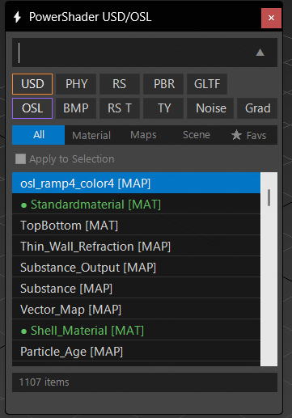
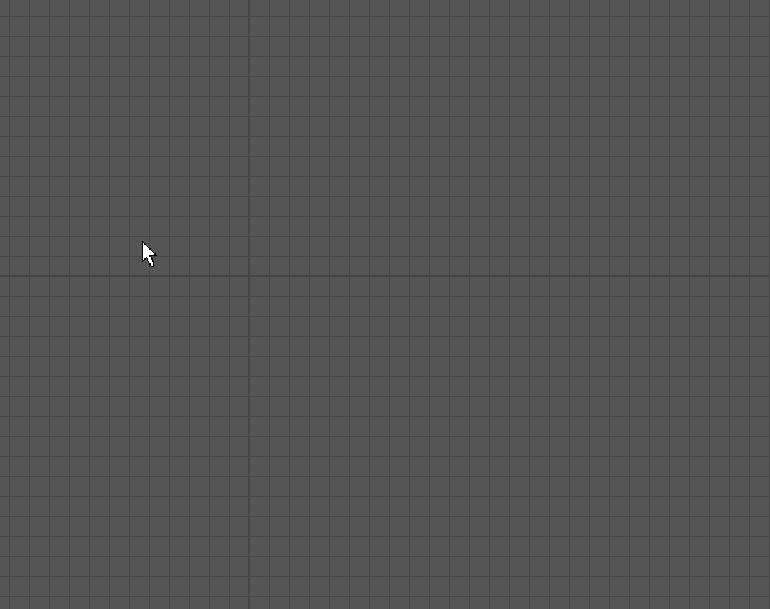
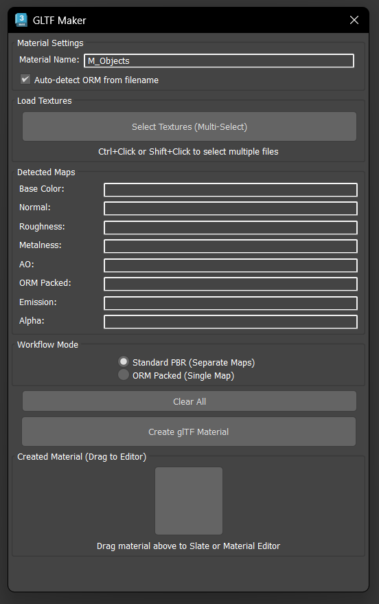
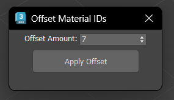
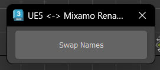
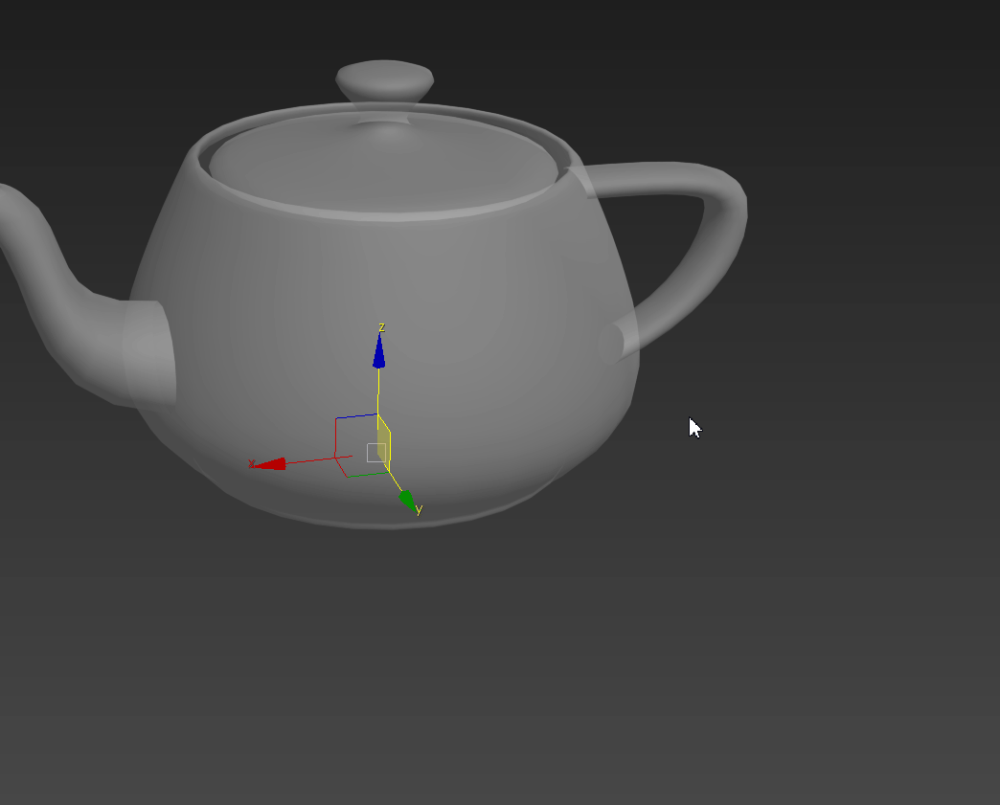

# CloneTools-3dsMax

Some 3dsmax scripts to speed up my workflows. Mostly USD related.


## Installation

Copy the desired scripts to your 3ds Max user scripts directory:
```
%USERPROFILE%\AppData\Local\Autodesk\3dsMax\<version>\ENU\scripts\
```
```
%USERPROFILE%\AppData\Local\Autodesk\3dsMax\<version>\ENU\usermacros\
```

---


### PowerShader.ms
Fast material search, creation, and instancing tool with drag-to-viewport support. Focused on USD and OSL workflows.




### GLTF_Maker.ms
Quickly load bitmaps from a folder and create GLTF materials in one click. Speeds up Babylon.js workflows. Supports USDpreviewsurface too.




### Offset_Material_IDs.ms
Offset material ID numbers on selected objects.



### PropagateMaterial.ms
Removes multi-materials from detached objects and keeps them as straight materials.

---

## Rigging

### Clone_CC_To_Biped.ms
Converts Reallusion standard skeleton (AccuRig or Character Creator) to 3ds Max Biped.

### Clone_UE_To_BIPED.ms
Converts Unreal Engine skeleton to 3ds Max Biped.


### UE5_Mixamo_BoneSwapper.ms
Swaps bone names between UE5 and Mixamo naming conventions. Useful for sending UE5 mannequin to Mixamo.



---

## Utilities

### ActivateManualRetopo.mcr
Quickly turns an object into a live surface and enables freeform retopology tools.



### Other Utilities
- **autoLogo.ms** - Batch processes SVG files into 3D models inside 3ds Max.
- **Collapse.ms** - Collapses modifiers but keeps TurboSmooth and Shell in the modifier stack.
- **CopyUV0toUV1.ms** - Copies UV channel 0 to UV channel 1. Useful for creating lightmaps based on existing UVs.
- **CloneTools-RotationAxisSnap.mcr** - Blender-style orthographic rotation axis snapping for 3ds Max.

---

## SME (Slate Material Editor)

- **OSL_SME_DropHandler.ms** - Startup script that changes default drag-and-drop texture behavior to use OSL Bitmap. By Changsoo Eun.
- **SME_RandomizeBitmapNames.ms** - Adds random seed values to bitmap node names. Useful for USD workflows to avoid naming conflicts.

---

## Requirements

- Autodesk 3ds Max 2024


## License

MIT License
